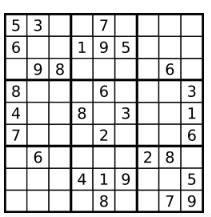
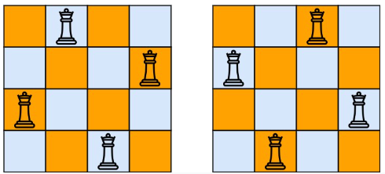
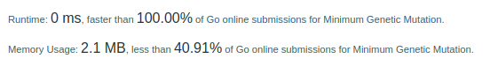

# LeetCodeHards

|      | Name         | Link to LeetCode                                                     | Code                                        | Level                                        ||
|------|--------------|----------------------------------------------------------------------|---------------------------------------------|----------------------------------------------|---|
| 37   | Sudoku solver | [link to leetcode.com](https://leetcode.com/problems/sudoku-solver/) | [code](./hard/37_solve_sudoku.go)           | **Hard**      ||
| 41   | First missing positive | [link to leetcode.com](https://leetcode.com/problems/first-missing-positive/) | [code](./hard/41_first_missing_positive.go) | **Hard**      ||
| 42   | Trapping rain water | [link to leetcode.com](https://leetcode.com/problems/trapping-rain-water/) | [code](./hard/42_trapping_rain_water.go)    | **Hard**      ||
| 44   | Wildcard Matching | [link to leetcode.com](https://leetcode.com/problems/wildcard-matching/) | [code](./hard/44_wildcard_matching.go)      | **Hard**      ||
| 51   | N-Queens | [link to leetcode.com](https://leetcode.com/problems/n-queens/) | [code](./hard/51_n_queens.go)               | **Hard**      ||
| 52   | N-Queens II | [link to leetcode.com](https://leetcode.com/problems/n-queens-ii/) | [code](./hard/51_n_queens.go)               | **Hard**      ||
| 60   | Permutation Sequence | [link to leetcode.com](https://leetcode.com/permutation-sequence/) | [code](./hard/60_permutation_sequence.go)   | **Hard**      ||
| 65   | Valid Number | [link to leetcode.com](https://leetcode.com/problems/valid-number/) | [code](./hard/65_valid_number.go)   | **Hard**      ||
| 68   | Valid Number | [link to leetcode.com](https://leetcode.com/problems/text-justification/) | [code](./hard/68_text_justification.go)   | **Hard**      ||
| 212  | Valid Number | [link to leetcode.com](https://leetcode.com/problems/word-search-ii/) | [code](./hard/212_word_search_II.go)   | **Hard**      |:calendar:|
| 899  | Valid Number | [link to leetcode.com](https://leetcode.com/problems/orderly-queue/) | [code](./hard/899_orderly_queue.go)   | **Hard**      |:calendar:|
| 1706 | Where Will the Ball Fall | [link to leetcode.com](https://leetcode.com/problems/where-will-the-ball-fall/) | [code](./medium/1706_where_will_the_ball_fall.go) | **Medium** |:calendar:|
| 433  | Minimum Genetic Mutation | [link to leetcode.com](https://leetcode.com/problems/minimum-genetic-mutation/) | [code](./medium/433_minimum_genetic_mutation.go) | **Medium** |:calendar:|
| 2131 | Longest Palindrome by Concatenating Two Letter Words | [link to leetcode.com](https://leetcode.com/problems/longest-palindrome-by-concatenating-two-letter-words/) | [code](./medium/2131_longest_palindrome_by_concatenating_two_letter_words.go) | **Medium** |:calendar:|

## Sudoku solver

## Trapping rain water

## Wildcard Matching

## N-Queens / N-Queens II

## Minimum Genetic Mutation
