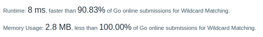

# LeetCodeHards

|      | Name                                                  | Link to LeetCode                                                     | Code                                        | Level                                        ||
|------|-------------------------------------------------------|----------------------------------------------------------------------|---------------------------------------------|----------------------------------------------|---|
| 37   | Sudoku solver                                         | [link to leetcode.com](https://leetcode.com/problems/sudoku-solver/) | [code](./hard/37_solve_sudoku.go)           | **Hard**      ||
| 41   | First missing positive                                | [link to leetcode.com](https://leetcode.com/problems/first-missing-positive/) | [code](./hard/41_first_missing_positive.go) | **Hard**      ||
| 42   | Trapping rain water                                   | [link to leetcode.com](https://leetcode.com/problems/trapping-rain-water/) | [code](./hard/42_trapping_rain_water.go)    | **Hard**      ||
| 44   | Wildcard Matching                                     | [link to leetcode.com](https://leetcode.com/problems/wildcard-matching/) | [code](./hard/44_wildcard_matching.go)      | **Hard**      ||
| 51   | N-Queens                                              | [link to leetcode.com](https://leetcode.com/problems/n-queens/) | [code](./hard/51_n_queens.go)               | **Hard**      ||
| 52   | N-Queens II                                           | [link to leetcode.com](https://leetcode.com/problems/n-queens-ii/) | [code](./hard/51_n_queens.go)               | **Hard**      ||
| 60   | Permutation Sequence                                  | [link to leetcode.com](https://leetcode.com/permutation-sequence/) | [code](./hard/60_permutation_sequence.go)   | **Hard**      ||
| 65   | Valid Number                                          | [link to leetcode.com](https://leetcode.com/problems/valid-number/) | [code](./hard/65_valid_number.go)   | **Hard**      ||
| 68   | Text Justification                                    | [link to leetcode.com](https://leetcode.com/problems/text-justification/) | [code](./hard/68_text_justification.go)   | **Hard**      ||
| 72   | Edit Distance                                         | [link to leetcode.com](https://leetcode.com/problems/edit-distance/) | [code](./hard/72_edit_distance.go)   | **Hard**      ||
| 76   | Minimum Window Substring                              | [link to leetcode.com](https://leetcode.com/problems/minimum-window-substring/) | [code](./hard/76_minimum_window_substring.go)   | **Hard**      ||
| 84   | Largest Rectangle in Histogram                        | [link to leetcode.com](https://leetcode.com/problems/largest-rectangle-in-histogram/) | [code](./hard/84_largest_rectangle_in_histogram.go)   | **Hard**      ||
| 85   | Maximal Rectangle                                     | [link to leetcode.com](https://leetcode.com/problems/maximal-rectangle/) | [code](./hard/85_maximal_rectangle.go)   | **Hard**      ||
| 87   | Scramble String                                       | [link to leetcode.com](https://leetcode.com/problems/scramble-string/) | [code](./hard/87_scramble_string.go)   | **Hard**      ||
| 151  | Reverse Words in a String                             | [link to leetcode.com](https://leetcode.com/problems/reverse-words-in-a-string/) | [code](./medium/151_reverse_words_in_a_string.go) | **Medium** |:calendar:|
| 212  | Word Search II                                        | [link to leetcode.com](https://leetcode.com/problems/word-search-ii/) | [code](./hard/212_word_search_II.go)   | **Hard**      |:calendar:|
| 222  | Count Complete Tree Nodes                             | [link to leetcode.com](https://leetcode.com/problems/count-complete-tree-nodes/) | [code](./medium/222_count_complete_tree_nodes.go) | **Medium** |:calendar:|
| 223  | Rectangle Area                                        | [link to leetcode.com](https://leetcode.com/problems/rectangle-area/) | [code](./medium/223_rectangle_area.go) | **Medium** |:calendar:|
| 295  | Find Median from Data Stream                          | [link to leetcode.com](https://leetcode.com/problems/find-median-from-data-stream/) | [code](./hard/295_find_median_from_data_stream_stack.go)   | **Hard**      |:calendar:|
| 433  | Minimum Genetic Mutation                              | [link to leetcode.com](https://leetcode.com/problems/minimum-genetic-mutation/) | [code](./medium/433_minimum_genetic_mutation.go) | **Medium** |:calendar:|
| 899  | Orderly Queue                                         | [link to leetcode.com](https://leetcode.com/problems/orderly-queue/) | [code](./hard/899_orderly_queue.go)   | **Hard**      |:calendar:|
| 901  | Online Stock Span                                     | [link to leetcode.com](https://leetcode.com/problems/online-stock-span/) | [code](./medium/901_online_stock_span.go) | **Medium** |:calendar:|
| 947  | Most Stones Removed with Same Row or Column           | [link to leetcode.com](https://leetcode.com/problems/most-stones-removed-with-same-row-or-column/) | [code](./medium/947_most_stones_removed_with_same_row_or_column.go) | **Medium** |:calendar:|
| 1706 | Where Will the Ball Fall                              | [link to leetcode.com](https://leetcode.com/problems/where-will-the-ball-fall/) | [code](./medium/1706_where_will_the_ball_fall.go) | **Medium** |:calendar:|
| 2131 | Longest Palindrome by Concatenating Two Letter Words  | [link to leetcode.com](https://leetcode.com/problems/longest-palindrome-by-concatenating-two-letter-words/) | [code](./medium/2131_longest_palindrome_by_concatenating_two_letter_words.go) | **Medium** |:calendar:|

## Sudoku solver

## Trapping rain water

## Wildcard Matching

## N-Queens / N-Queens II

## Minimum Genetic Mutation
